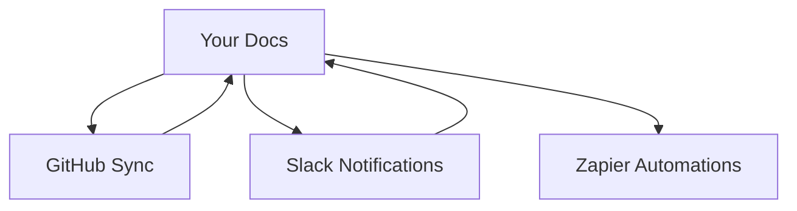

## Overview

Manage your Vaishnavi Nandankar documentation at scale with advanced features. You control user permissions, customize branding, export content, and integrate with tools. These capabilities help teams collaborate efficiently while maintaining consistency.

<Columns cols={2}>
  <Card title="Permissions & Collaboration" icon="users" href="#permissions">
    Assign roles and manage access for team members.
  </Card>
  <Card title="Custom Themes" icon="palette" href="#themes">
    Tailor your docs with branding and styles.
  </Card>
  <Card title="Export/Import" icon="upload" href="#export">
    Backup or migrate your documentation.
  </Card>
  <Card title="Integrations" icon="plug" href="#integrations">
    Connect with GitHub, Slack, and more.
  </Card>
</Columns>

## User Permissions and Collaboration

Control who accesses your docs. Define roles like Viewer, Editor, and Admin to enable secure teamwork.

<Callout kind="tip">
  Start with least privilege: Assign Viewer roles first, then promote as needed.
</Callout>

<Tabs>
  <Tab title="Admin" icon="shield">
    Full control over all docs, users, and settings.
  </Tab>
  <Tab title="Editor" icon="edit">
    Create and modify content, but cannot manage users.
  </Tab>
  <Tab title="Viewer" icon="eye">
    Read-only access to published pages.
  </Tab>
</Tabs>

### Set Up Permissions

Follow these steps to invite collaborators.

<Steps>
  <Step title="Invite User" icon="user-plus">
    Navigate to Settings > Team. Enter email and select role.
  </Step>
  <Step title="Configure Access" icon="settings">
    Choose specific spaces or grant global access.
  </Step>
  <Step title="Review Audit Log" icon="file-text">
    Monitor changes via the activity feed.
  </Step>
</Steps>

## Custom Themes and Branding

Apply your brand with custom CSS and themes. Use the theme editor or API for advanced setups.

<CodeGroup tabs="JSON,CSS">
  ````json
  {
    "primaryColor": "#3B82F6",
    "fontFamily": "Inter, sans-serif",
    "logoUrl": "https://your-site.com/logo.png"
  }
  ````

  ````css
  :root {
    --brand-color: #3B82F6;
  }

  .header {
    background: var(--brand-color);
  }
  ````
</CodeGroup>

<Expandable title="Advanced CSS Variables" default-open="false">
  Override defaults with custom properties. Test in preview mode before publishing.
</Expandable>

## Exporting and Importing Docs

Backup your work or migrate between spaces. Export formats include Markdown, PDF, and HTML.

### Export Process

<Steps>
  <Step title="Select Space" icon="folder">
    Choose the documentation space to export.
  </Step>
  <Step title="Choose Format" icon="download">
    Pick Markdown for edits or PDF for sharing.
  </Step>
  <Step title="Download" icon="save">
    Generate and download the archive.
  </Step>
</Steps>

Import follows similar steps: Upload ZIP or folder via the import tool.

<Callout kind="alert">
  Large exports may take time. Use filters to select specific pages.
</Callout>

## Integration with External Tools

Connect Vaishnavi Nandankar to your workflow.

| Tool       | Purpose                  | Setup Command                  |
|------------|--------------------------|--------------------------------|
| GitHub    | Sync docs as repo       | `/integrations/github`        |
| Slack     | Notifications           | Add webhook: `YOUR_WEBHOOK_URL` |
| Zapier    | Automations             | Connect via OAuth             |

### GitHub Integration Example

````bash
# Clone your docs repo
git clone https://github.com/your-org/vaishnavi-docs.git

# Push changes
git add .
git commit -m "Update advanced management"
git push origin main
````

<Columns cols={3}>
  <Card title="GitHub Sync" icon="github" href="https://github.com" target="_blank">
    Two-way sync for version control.
  </Card>
  <Card title="Slack Alerts" icon="message-circle" href="#">
    Real-time update notifications.
  </Card>
  <Card title="More Tools" icon="plug" href="#integrations">
    Explore API for custom integrations.
  </Card>
</Columns>



Master these features to scale your documentation. Review [permissions](#permissions) regularly for security.